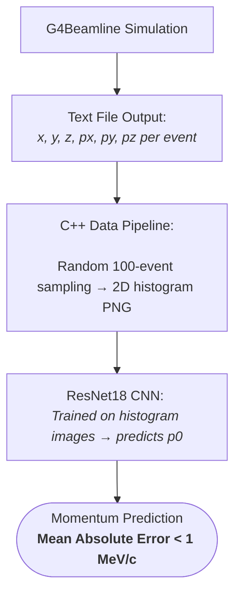

# Reconstruction of 6D Phase Space via Machine Learning

**Fermi National Accelerator Laboratory — Summer 2026**  
**Jermaine Shirlee | Supervisor: Dr. Katsuya Yonehara**

---

## Overview

Particle beams at Fermilab exist in a six-dimensional (6D) phase space defined 
by three positional components (x, y, z) and three momentum components 
(px, py, pz). Beam detectors are limited to recording spatial distribution 
making it computationally difficult measure momentum.

This project tests the capabilities Machine Learning to reconstruct the initial 
momentum  magnitude (p0) of a simulated muon beam from spatial distribution data alone, 
demonstrating an efficient computational approach to momentum measurement.

---

## Pipeline

